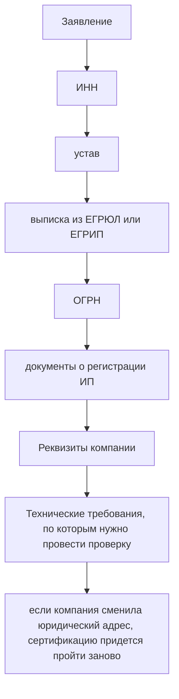
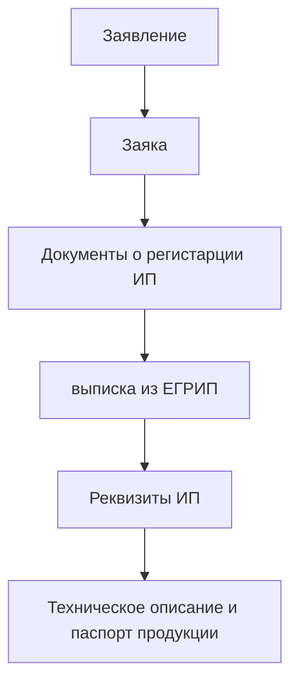
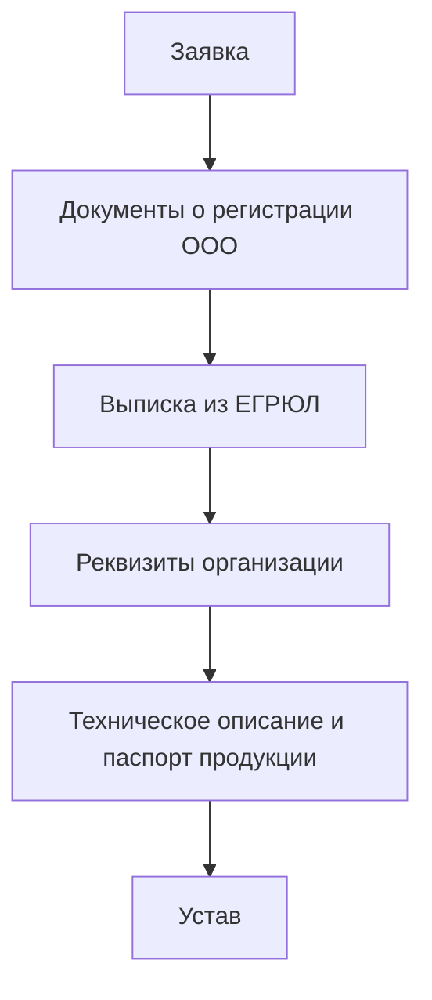
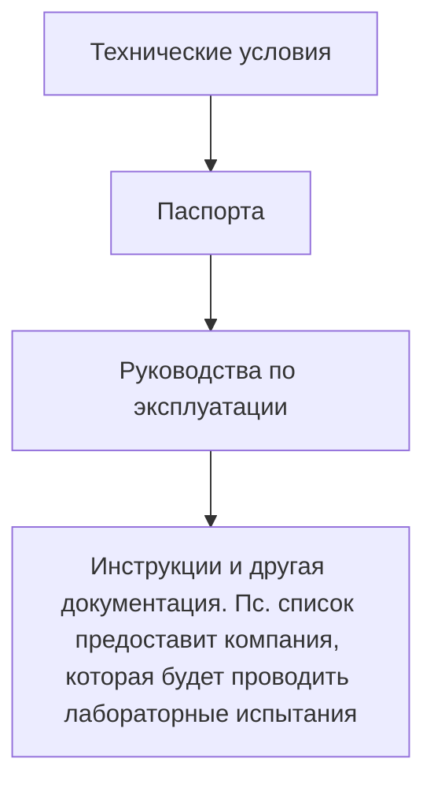

# Сделать схему нормативных документов, которые регламентируют получение Сертификата о соответсствии

```mermaid 
    flowchart TD;
    A[Заявление] --> B[ИНН] --> C[устав] --> D[выписка из ЕГРЮЛ или ЕГРИП] --> E[ОГРН] --> F[документы о регистрации ИП] --> G[Реквизиты компании] --> H[Технические требования, по которым нужно провести проверку] --> I[если компания сменила юридический адрес, сертификацию придется пройти заново]
```
документы для ИП

```mermaid 
    flowchart TD;
    A[Заявление] --> B[Заяка] --> C[Документы о регистарции ИП] --> D[выписка из ЕГРИП] --> E[Реквизиты ИП] --> F[Техническое описание и паспорт продукции]
```
для ООО

```mermaid 
    flowchart TD;
    A[Заявка] --> B[Документы о регистрации ООО] --> C[Выписка из ЕГРЮЛ] --> D[Реквизиты организации] --> E[Техническое описание и паспорт продукции] --> F[Устав]
```
подготовка документов

```mermaid 
    flowchart TD;
    A[Технические условия] --> B[Паспорта] --> C[Руководства по эксплуатации] --> D[Инструкции и другая документация. Пс. список предоставит компания, которая будет проводить лабораторные испытания]
```